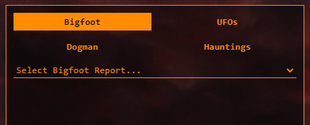

# Mapping The Truth

Hosted URL: https://ashlander0.github.io/Mapping-The-Truth/

This project is a visualization of various supernatural and conspiracy occurances throughout the US. We utilized 4 datasets released by the same source on Data.World.

- Bigfoot: 		https://data.world/timothyrenner/bfro-sightings-data
- UFO Sightings: 	https://data.world/timothyrenner/ufo-sightings
- Dogman: 		https://data.world/timothyrenner/dogman-sightings
- Haunted Places: https://data.world/timothyrenner/haunted-places

This page is making use of Javascript to read data from json files, and create most of the interactive functionality, specifically benifitting from the D3.js library. Other libraries used include Leaflet.js, to produce the map, and Plotly.js for the right side visualizations.

## Objectives

- Display each sighting on a map of the US, with a popup providing information on that specific sighting.
- Toggle the different incident types on the map. (not yet implemented)
- Create toggle buttons and a dropdown menu for selecting specific sightings, which brings up associated data.

##### Remaining Work To Be Done

- Implement a toggle function on the map (perhaps utilizing the dropdown buttons for selection)
- Expand the visualization pane to include more graghs
- Speed up the page loading. (most likely requires providing/reading the data using a different method)

---

## Usage

### Dropdown Menu

Click any of the dataset buttons in the top left to activate the dropdown menu for that dataset. After selecting a sighting from the dropdown menu, the left side panel with populate with data relating to the selected sighting. The map will also zoom into the location of the incident.

### Map

The map is fairly self explainitory. It features the usual scrolling and zooming functionality. The map style can be changed via a menu in the top right corner, which may help with readability on darker screens. The data is represented on the map by different icons according to the dataset. Clicking on an icon zooms the map into the location, and opens a popup with some basic information about the incident. It will also populate the left panel with more detailed information similar to finding that incident in the dropdown menu.
